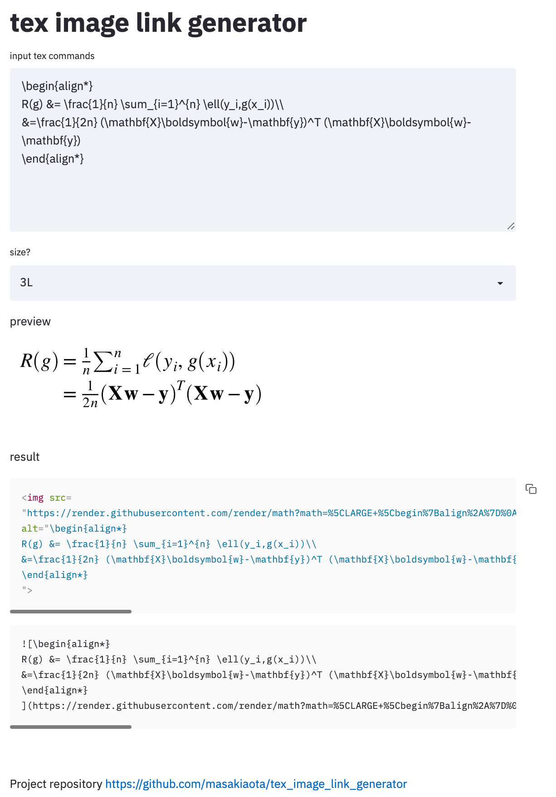
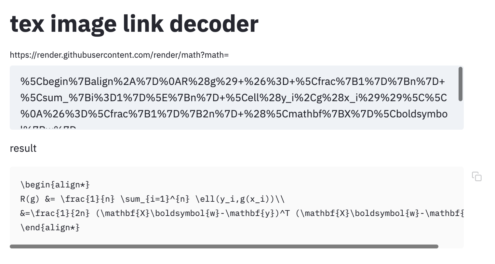

# tex_image_link_generator

Visit here
https://tex-image-link-generator.herokuapp.com/

### What's this?

Now, you can use  command in github readme (this readme), github issues (like [this](https://github.com/masakiaota/tex_image_link_generator/issues/1)) and other blog services.

#### reference

https://gist.github.com/a-rodin/fef3f543412d6e1ec5b6cf55bf197d7b

